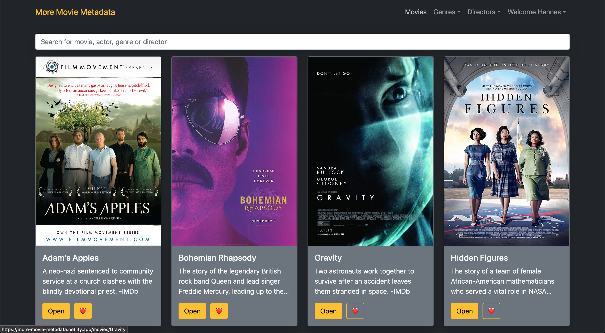
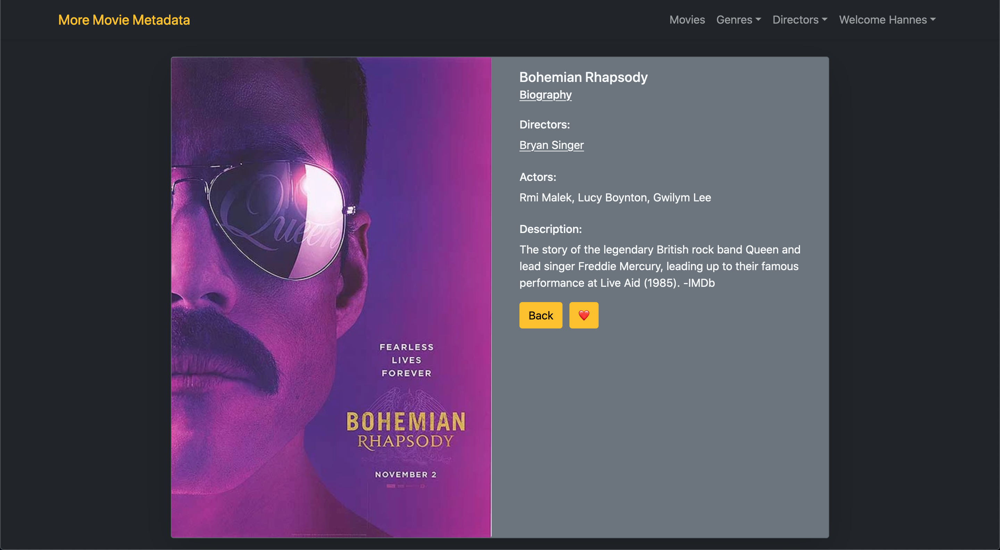

# MORE MOVIE METADATA - Client

Welcome to the UI client for my <a href="https://github.com/hannesdonel/MMM">MORE MOVIE METADATA API</a>. This React single page application will provide you graphically appealing with access to information about different movies, directors, and genres stored on a MongoDB database.
It's possible to sign up to create a unique list of favorite movies.

<a href="https://more-movie-metadata.netlify.app/">Use the app.</a>

## Technologies

- JavaScript, HTML, SCSS
- React
- React Router
- Redux
- Bootstrap
- axios
- parcel

App is hosted on <a href="https://www.netlify.com/">Netlify</a>.

## Functionality

#### Registration view
- Allows new users to register (username, password, email, birthday)

#### Login view
- Log in with a username and password

#### Main view
- Returns a list of all movies (each listed item with an image, title, genres, directors, actors and
description)
- Sorting and filtering
- Ability to select a movie for more details

#### Single movie view
- Returns data (description, genres, directors, actors, image) about a single movie
- Add or remove movie to list of favorites

#### Genre and director view
- Returns data about a genre or director, with a name and description/bio
- Displays example movies

#### Profile view
- Update user info (username, password, email, date of birth)
- User derigistration
- Display and alter list of favorite movies

#### Optional Views and Features
Single movie view and all movies views
- Allow users to see which actors star in which movies